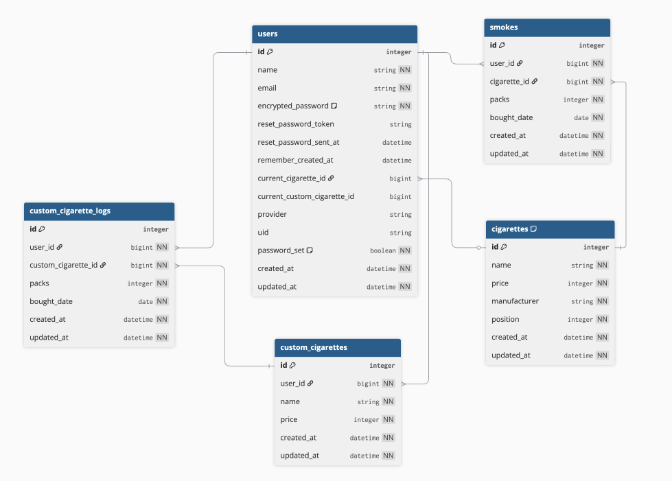

## サービス概要
Smoker Bankは、自分が吸ったタバコの本数を簡単に記録できるアプリです。  
累計金額を自動計算し、「もし吸わなければ何が買えたか」を可視化します。  
日々のタバコ消費を振り返ることで、節煙や健康管理にも役立ちます。

## このサービスへの思い・作りたい理由
よく聞く話で「辞めてればこの車買えたよ」という言葉が挙げられます。  
ただそれは例え話と言いますか、喫煙者に対する皮肉な言葉に思えますよね。  
その話を思い出した時、では自分は今一体いくらタバコにお金を使っていて、  
もし吸っていなかったら何が買えたのだろう、と気になったことが、このアプリを作成するきっかけとなりました。  

タバコを辞めたい、というよりは、自分はどれだけのお金を使って、代わりにどんなものが買えたのかという、  
ユーザーに少し夢のある体験をして欲しい、そんなアプリとなっています。  

## ユーザー層について
- 主にタバコを吸う20〜40代のユーザー  
  → 自分の喫煙習慣を把握したい層であり、出費管理や節煙の意識付けが効果的と考えました。  
- 「タバコを買わなければこれが買えた」を知りたい人  
  → タバコを吸っていない自分を想像できるため、夢が膨らみ、妄想を楽しんでいただけるかなと考えました。  

## サービスの利用イメージ
1. ユーザーはタバコを購入した個数をアプリに入力  
2. 入力したデータに基づき累計箱数と累計金額を自動計算  
3. 「もし吸わなければ買えたもの」が可視化され、吸っていない自分を想像してもらう  

## ユーザーの獲得について
- SNSでの告知  
- 個人ブログなどでの紹介  
- アプリ内のシンプルで直感的なUIにより、口コミでの拡散を狙う  

## サービスの差別化ポイント・推しポイント
- 単純な喫煙記録アプリではなく、累計金額に応じた「もし買えたもの」を提示する独自機能  
- 「もし買えたもの」が提示されるため、吸っていなかった世界線の自分を想像し、楽しんでもらえる  
- よくある「吸った本数」ではなく、購入時の箱数だけを入力するため、記録するタイミングが少なく、飽きにくい  
- 禁煙記録アプリに禁煙できた金額に応じた「もし買えたもの」リストはあったが、喫煙記録アプリでは見受けられないため、差別化ができている。  
- LINE通知機能を使い、忘れがちな「記録する」を促す。(MVPリリース後)  

## 機能候補(MVPリリース時)
- ユーザー登録(メールorGoogleログイン認証)  
- タバコの箱数入力  
- 累計本数・累計金額の自動計算  
- 過去データの一覧表示  
- 「もし買えたもの」リストの表示  
- DBにないタバコの金額設定
- Xの共有

## 機能候補(拡張機能)
- LINE通知機能  
- ユーザーオリジナルの「もし買えたもの」リストの作成機能  
- ユーザー情報の変更画面  

## 使用する技術スタック
- 使用するフレームワーク（Ruby on Rails / 8.0.2.1 以上 8.1 未満）
- データベース（PostgreSQL）
- デプロイ先（Render）
- 使用予定のGem（ransack / kaminari / Tailwind / line-bot-sdk-ruby / Devise / omniauth-google-oauth2）

## 画面遷移図
[画面遷移図（Figma）](https://www.figma.com/design/oS8wTW6u0WIxZXqUt9bmDp/smoker-bank?node-id=0-1&t=X7aWSsd2NaSFdeJh-1)

## ER図

